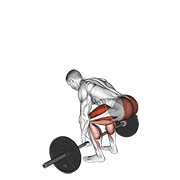
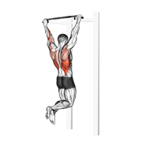
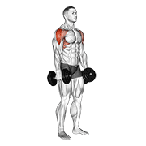

<div align="center">

# 💪 Exercises Dataset

<p>
  
  
  
  
  
  
</p>

**A comprehensive, ready-to-use fitness exercise dataset with 1,324 exercises — each with an animation GIF, 180×180 thumbnail image, category, body-part, equipment, target and muscle-group data, and step-by-step instructions in 10 languages (English, Spanish, Italian, Turkish, Russian, Chinese, Hindi, Polish, Korean, French).**

</div>

---

## 📦 Data Source

**This repository provides:**

- 1,324 exercises with category, body-part, equipment, target and muscle-group data
- an animation GIF + 180×180 thumbnail for every exercise 
- step-by-step instructions in 10 languages (🇬🇧 English, 🇵🇸 Persian)
- the interactive browser (`index.html`)

---

## 📋 Table of Contents

- [Data Source](#-data-source)
- [Overview](#-overview)
- [Interactive Browser & Developer Setup](#-interactive-browser--developer-setup)
- [File Structure](#-file-structure)
- [Statistics](#-statistics)
- [Data Schema](#-data-schema)
- [Sample Exercises](#-sample-exercises)
- [Usage Examples](#-usage-examples)
- [License & Use](#-license--use)

---

## 🔍 Overview

This dataset is a curated collection of **1,324 fitness exercises** for educational and research purposes. It covers a wide range of muscle groups, equipment types, and exercise categories — making it ideal for:

- Building fitness or workout planning applications
- Machine learning projects involving exercise recognition or recommendation
- Health and wellness research
- Educational demonstrations and prototypes

Each exercise entry contains:

| Field | Description |
|---|---|
| Unique ID | Numeric identifier (e.g. `"0001"`) |
| Name | Full descriptive exercise name |
| Category | Primary muscle group targeted |
| Target | Specific target muscle |
| Muscle Group | Supporting / synergist muscles |
| Equipment | Equipment required (or `body weight` for bodyweight) |
| Instructions | Step-by-step instructions for each exercise |
| Available Languages | 🇬🇧 English · 🇵🇸 Persian |
| Media | 180×180 thumbnail (`image`) + animation GIF (`gif_url`) per exercise — media © Gym visual, see [License](#-license--use) |

---

## 🖥️ Interactive Browser & Developer Setup

This repository includes two ready-to-use HTML tools — no server required, just open in a browser.

> **Note:** the browser displays each exercise's 180×180 thumbnail and animation GIF alongside its metadata and instructions.

### `index.html` — Exercise Browser

A fully client-side exercise explorer with:
- Live search across all 1,324 exercises
- Filter by category, equipment, and target muscle
- Infinite scroll grid
- Click any card to see full details and instructions in English, Persian

---

## 📂 File Structure

```
exercises-dataset/
├── data/
│   ├── exercises.json        # Full dataset — 1,324 exercise records (JSON array)
│   └── exercises.schema.json # JSON Schema (2020-12) describing every record
├── images/                  # 1,324 × 180×180 thumbnails  (© Gym visual)
├── videos/                  # 1,324 × 180×180 animation GIFs  (© Gym visual)
├── index.html               # Interactive exercise browser (client-side, no server needed)
└── README.md
```

### Key Files

- **`data/exercises.json`** — The primary data file. A JSON array of 1,324 exercise objects with all metadata. `image` / `gif_url` point to the local 180×180 assets, and each record carries an `attribution` field; `media_id` holds the original media reference id.
- **`data/exercises.schema.json`** — A [JSON Schema](https://json-schema.org/) (Draft 2020-12) that formally describes every field, its type and constraints. Use it to validate the dataset or your own additions with any standard JSON Schema validator.
- **`images/`, `videos/`** — 180×180 thumbnails and animation GIFs (© [Gym visual](https://gymvisual.com/), used with permission).
- **`index.html`** — Standalone exercise browser. Open directly in any modern browser.
- **`LICENSE`, `NOTICE.md`** — MIT (code/data) + the Gym visual media terms.

---

## 📊 Statistics

| Metric | Count |
|---|---|
| Total Exercises | **1,324** |
| Instruction Languages | **10** |

### Exercises by Body Part

| Body Part | Exercise Count |
|---|---|
| Upper Arms | 292 |
| Upper Legs | 227 |
| Back | 203 |
| Waist | 169 |
| Chest | 163 |
| Shoulders | 143 |
| Lower Legs | 59 |
| Lower Arms | 37 |
| Cardio | 29 |
| Neck | 2 |

### Exercises by Equipment

| Equipment | Exercise Count |
|---|---|
| Body Weight | 325 |
| Dumbbell | 294 |
| Cable | 157 |
| Barbell | 154 |
| Leverage Machine | 81 |
| Band | 54 |
| Smith Machine | 48 |
| Kettlebell | 41 |
| Weighted | 36 |
| Stability Ball | 28 |
| EZ Barbell | 23 |
| Other | 83 |

> **Note:** ~25% of exercises require no equipment at all — great for at-home workout applications.

---

## 🗂️ Data Schema

Each record in `data/exercises.json` follows this structure. A machine-readable [JSON Schema](data/exercises.schema.json) is also provided for validation.

| Field | Type | Description |
|---|---|---|
| `id` | `string` | Unique numeric identifier (e.g. `"0001"`) |
| `name` | `string` | Full exercise name (e.g. `"3/4 Sit-up"`) |
| `category` | `string` | Body part category (e.g. `"upper arms"`, `"chest"`, `"back"`) |
| `body_part` | `string` | Same as `category` — body part targeted |
| `equipment` | `string` | Required equipment (e.g. `"dumbbell"`, `"body weight"`) |
| `instructions.en` | `string` | Full step-by-step instructions in English |
| `instructions.fa` | `string` | Full step-by-step instructions in Persian |
| `instruction_steps.<lang>` | `array[string]` | Same instructions split into an ordered array of steps, per language (`en`, `fa`) |
| `muscle_group` | `string` | Primary synergist muscle group |
| `secondary_muscles` | `array[string]` | Additional muscles involved |
| `target` | `string` | Primary target muscle (e.g. `"biceps"`, `"pectoralis major"`) |
| `media_id` | `string` | Original media reference id (e.g. `"2gPfomN"`) |
| `image` | `string` | Path to the 180×180 thumbnail (e.g. `"images/0001-2gPfomN.jpg"`) |
| `gif_url` | `string` | Path to the 180×180 animation GIF (e.g. `"videos/0001-2gPfomN.gif"`) |
| `attribution` | `string` | Media copyright notice — `"© Gym visual — https://gymvisual.com/"` |
| `created_at` | `string` | ISO 8601 timestamp of record creation |

### Sample Record

```json
{
  "id": "0001",
  "name": "3/4 sit-up",
  "category": "waist",
  "body_part": "waist",
  "equipment": "body weight",
  "instructions": {
    "en": "Lie flat on your back with your knees bent and feet flat on the ground. Place your hands behind your head with your elbows pointing outwards. Engaging your abs, slowly lift your upper body off the ground, curling forward until your torso is at a 45-degree angle. Pause for a moment at the top, then slowly lower your upper body back down to the starting position. Repeat for the desired number of repetitions.",
    "fa": "در حالت افتادن روی پشت با زانوی خم و پاها در لمس زمین. دست هایتان را پشت سر قرار دهید تا آرنج هایتان به بیرون باشند. با فعال کردن عضلات شکم، به آرامی بدن بالایی را از زمین بلند کنید و تا زمانی که بدنتان در زاویه 45 درجه باشد، به جلو حرکت کنید. چند لحظه در بالای حرکت متوقف شوید و سپس به آرامی بدن بالایی را به موقعیت شروع برگردانید. برای تعداد مورد نظر تکرار کنید."
  },
  "muscle_group": "hip flexors",
  "secondary_muscles": ["hip flexors", "lower back"],
  "target": "abs",
  "media_id": "2gPfomN",
  "image": "images/0001-2gPfomN.jpg",
  "gif_url": "videos/0001-2gPfomN.gif",
  "attribution": "© Gym visual — https://gymvisual.com/",
  "created_at": "2026-03-18T12:31:32.854798+00:00"
}
```

---

## 🎬 Sample Exercises

> Each example ships a 180×180 thumbnail (`image`) and animation GIF (`gif_url`).

### 1 — Barbell Bench Press · Chest


> **Equipment:** Barbell · **Target:** Pectorals · **Secondary:** Triceps, Shoulders · **Media ID:** `EIeI8Vf`

The Barbell Bench Press is the cornerstone of chest training and one of the "Big Three" powerlifting movements. Lying flat on a bench, you lower a loaded barbell to your chest and press it back up explosively. It simultaneously recruits the pectorals, triceps, and anterior deltoids, making it the single most effective exercise for upper body pushing strength and chest mass development.

**Key cues:** Retract and depress your scapulae before unracking. Keep your feet flat on the floor, arch your lower back naturally, and maintain a shoulder-width grip. Lower the bar under control to mid-chest and drive up through the heels.

### 2 — Barbell Deadlift · Upper Legs / Back


> **Equipment:** Barbell · **Target:** Glutes · **Secondary:** Hamstrings, Lower Back · **Media ID:** `ila4NZS`

The Barbell Deadlift is widely regarded as the ultimate full-body strength exercise. It engages virtually every major muscle in the posterior chain — glutes, hamstrings, and lower back — while also demanding significant contribution from the upper back, traps, and grip. Proper spinal alignment and bracing technique are critical for both performance and safety.

**Key cues:** Set up with the bar over your mid-foot. Hinge at the hips, grip just outside your legs, brace your core hard, and keep the bar in contact with your shins throughout the lift. Drive the floor away, lock out at the top by squeezing glutes and extending hips fully.

### 3 — Barbell Full Squat · Upper Legs


> **Equipment:** Barbell · **Target:** Glutes · **Secondary:** Quadriceps, Hamstrings, Calves, Core · **Media ID:** `qXTaZnJ`

Often called "the king of all exercises," the Barbell Full Squat demands coordinated strength across the entire lower body and core. Breaking parallel maximizes glute and hamstring activation compared to partial squats. It is the foundation of nearly every strength and hypertrophy program.

**Key cues:** Bar on upper traps (high bar) or rear deltoids (low bar). Brace your core before descent, push knees out in line with toes, sit into your hips, and descend until your thighs pass parallel to the floor. Drive through the whole foot to stand.

### 4 — Dumbbell Biceps Curl · Upper Arms


> **Equipment:** Dumbbell · **Target:** Biceps · **Secondary:** Forearms · **Media ID:** `NbVPDMW`

The Dumbbell Biceps Curl is the most recognized isolation exercise for the arms. Training each side independently helps identify and correct strength imbalances between limbs. The supinated (palms-up) grip maximizes biceps contraction at the top of the movement.

**Key cues:** Stand tall with elbows pinned to your sides. Supinate your wrists as you curl up, squeeze at the top, and lower under control without swinging. Avoid using momentum from the shoulders or lower back.

### 5 — Pull-up · Back


> **Equipment:** Body Weight · **Target:** Lats · **Secondary:** Biceps, Forearms · **Media ID:** `lBDjFxJ`

The Pull-up is the gold standard bodyweight exercise for upper body pulling strength. It primarily develops the latissimus dorsi — creating the coveted V-taper — while heavily involving the biceps, rear deltoids, and core stabilizers. It scales from beginner (band-assisted) to advanced (weighted).

**Key cues:** Dead hang from an overhand grip, shoulder-width or slightly wider. Initiate with your lats by depressing your shoulder blades, then pull your chest toward the bar. Lower fully between reps to maintain range of motion.

### 6 — Dumbbell Lateral Raise · Shoulders


> **Equipment:** Dumbbell · **Target:** Delts · **Secondary:** Traps · **Media ID:** `DsgkuIt`

The Dumbbell Lateral Raise is the go-to isolation exercise for building shoulder width. It directly targets the lateral (middle) head of the deltoid, which is responsible for the broad-shouldered look. Controlled tempo and strict form matter far more than load.

**Key cues:** Stand with a slight bend in your elbows throughout. Raise the dumbbells out to the sides until your arms are parallel to the floor — no higher. Lead with your elbows, not your wrists. Lower slowly under control to maximize time under tension.

---

## 🚀 Usage Examples

### Python — Load and Filter

```python
import json

with open("data/exercises.json", "r", encoding="utf-8") as f:
    exercises = json.load(f)

print(f"Total exercises loaded: {len(exercises)}")

# Filter by category
chest_exercises = [ex for ex in exercises if ex["category"] == "chest"]
print(f"Chest exercises: {len(chest_exercises)}")
# -> Chest exercises: 163

# Filter by equipment
bodyweight = [ex for ex in exercises if ex["equipment"] == "body weight"]
print(f"Bodyweight exercises: {len(bodyweight)}")
# -> Bodyweight exercises: 325

# Get all unique categories
categories = sorted({ex["category"] for ex in exercises})
print("Categories:", categories)

# Access multilingual instructions
ex = exercises[0]
print(ex["instructions"]["en"])  # English
print(ex["instructions"]["fa"])  # Farsi
```

### Python — Load with Pandas

```python
import json
import pandas as pd

with open("data/exercises.json", "r", encoding="utf-8") as f:
    data = json.load(f)

df = pd.DataFrame(data)

# Top categories by exercise count
print(df["category"].value_counts().head(10))

# All barbell exercises targeting upper legs
barbell_quads = df[(df["equipment"] == "barbell") & (df["category"] == "upper legs")]
print(barbell_quads[["name", "target", "equipment"]])
```

### JavaScript / Node.js

```js
const exercises = require("./data/exercises.json");

console.log(`Total exercises: ${exercises.length}`);

// Bodyweight exercises only
const bodyweight = exercises.filter(ex => ex.equipment === "body weight");
console.log(`Bodyweight exercises: ${bodyweight.length}`);
// -> Bodyweight exercises: 325

// Group exercises by category
const byCategory = exercises.reduce((acc, ex) => {
  acc[ex.category] = (acc[ex.category] || []);
  acc[ex.category].push(ex);
  return acc;
}, {});

// Access multilingual instructions
const ex = exercises[0];
console.log(ex.instructions.en); // English
console.log(ex.instructions.fa); // Farsi
```

### TypeScript — Type-safe Usage

```typescript
interface Exercise {
  id: string;
  name: string;
  category: string;
  body_part: string;
  equipment: string;
  instructions: {
    en: string;
    fa: string;
  };
  instruction_steps: {
    en: string[];
    fa: string[];
  };
  muscle_group: string;
  secondary_muscles: string[];
  target: string;
  media_id: string;
  image: string;
  gif_url: string;
  attribution: string;
  created_at: string;
}

import exercises from "./data/exercises.json";
const data = exercises as Exercise[];

const randomWorkout: Exercise[] = data.slice(0, 6);
console.log("First 6 exercises:", randomWorkout.map(e => e.name));
```